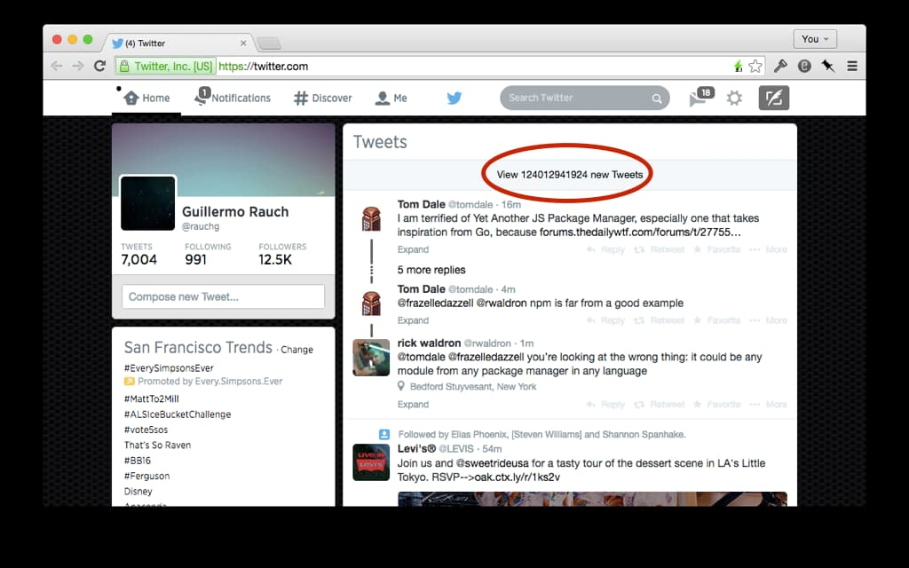

## 7 Principles of Rich Web Applications
## Guillermo Rauch.
## November 4, 2014
## https://rauchg.com/2014/7-principles-of-rich-web-applications

nextjs 的 team 說是主要被這篇啟發的，所以才開發 nextjs  
主要提出 7 點論點  

### 1. Server渲染頁面仍然是必須的
TL;DR : **SSR 主要的考慮是性能**與SEO無關，需要考慮的包括不在服務器渲染的話，
- 請求腳本
- 頁面樣式
- 頁面資源
- API請求

造成的額外的開銷，以及考慮在
- HTTP2.0裡加入的PUSH of resources。

**在業界有一種錯誤的二分法："SSR" 和“CSR"的對立。**  
如果我們的目標是用戶體驗和性能的最優化，那麼選擇其中任何一個而拋棄另一個都是錯誤的決定。
原因其實很明顯：整個互聯網用於傳輸頁面的介質，有一個理論上可計算的速度局限。  

- 從波士頓到斯坦福 4320km，路上花費的85ms，當然會隨著時間的推移不斷的改善
- 但就算達到了光速，這兩個海岸間最少也需要50ms才能完成通信。

換句話說，用戶間連接的帶寬再怎麼顯著提高，花在傳輸路上的**延遲總有無法突破的速度極限**。  

> 所以，在頁面上顯示信息時減少請求次數，也就是減少信息被傳輸在路上的次數，對於良好的用戶體驗和出色的響應速度而言，至關重要。

這一點在Javascript驅動的Web應用流行起來之後顯得尤為明顯（就像 SPA）。  
這些應用 "<body>" 標籤內甚麼東西都沒有，只有"< script >"和"< link >"標籤  
服務器返回時一直在重用同一個頁面，其他的頁面內容都是在客戶端被處理和渲染的。  

用戶在瀏覽器上訪問 http://app.com/orders/ 
- 如果這是一個傳統的網頁，那麼在後台處理這個請求的時，就會帶回重要的信息，用來完成頁面的顯示
- 比如，從數據庫裡面查詢出訂單，然後把它們的數據放在請求的返回裡面。

- 但如果這是一個SPA，那麼第一次可能會立刻返回一個包含< script >標籤的空頁面
- 然後再跑一趟才能拿回用來渲染頁面的內容和數據。

目前大多數的開發者大家形成了這麼一個共識，既然整個代碼包一旦加載一次，就可以不用再請求其他的腳本和資源就完成對絕大多數的用戶交互（包括跳轉到應用的其他頁面）的處理，那麼這個開銷就是可以接受的。  
但實際上，雖然有cache，腳本解析和執行的時間仍然會帶來性能上的下降。 “Is jQuery Too Big For Mobile?”這篇文章就探討了即便是加載一個jQuery庫，就會花去一些瀏覽器數百毫秒的時間。  

> 和以前網速慢那種圖片慢慢加載的效果不同，如果是腳本正在加載，用戶什麼都看不到：在整個頁面被渲染出來之前，只能顯示空白的頁面。  

最重要的是，目前互聯網數據傳輸主要的協議TCP 建立比較慢。  
1.  一個TCP連接先需要握手。 如果處於安全考慮使用了SSL，就還需要額外的兩個來回（客戶端重用了session的話，也需要一個額外的來回）。 這些流程完畢之後，服務器才能開始往客戶端發送數據。再小的代碼包實際上也需要幾個來回才能完成傳輸，這就讓前面描述的問題變得更加糟糕。

2. TCP協議裡面有一個流控機制，被稱為 `slow start`，也就是在連接建立過程中逐漸增加傳輸的分段( segments )大小這對SPA有兩個很大的影響：
  - 文件比較大的腳本，花在下載上的時間比你想像中的要長得多。
  - 因為前面說的延遲對首個頁面訪問也是有效的，所以**讓什麼數據最先被傳輸就顯得非常重要**。 Paul Irish在他的演講“Delivering the Goods”給出的結論是，**一個Web應用最開始的14kb數據是最重要的**。  

在足夠短的時間窗內完成內容傳輸（哪怕只是呈現基本的沒有數據的layout）的網站，就是響應良好的。  
但是，服務器在輔助和加速頁面內容的分發和渲染中應該被怎麼使用，也是需要根據每個應用場景仔細分析的。 在一些情況下，如果對用戶來說**頁面上的內容不是非看不可的，就可以不放在第一個響應中返回，而是讓客戶端在​​後面的操作中到服務器去取**。

服務器能夠根據
- 當前處理的session
- 用戶
- URL對腳本
- 样式文件

進行分類也是很重要的。舉例，用來對訂單進行分類的腳本，對於/orders這個URL顯然是重要的，而處理"首選項"的邏輯的腳本就不那麼重要。 再比如，可以對CSS樣式表進行分類，比如區分
- “結構性的樣式” 和
- “皮膚和模板的樣式”

等。前面這類很可能對Javascript的正確運行是必須的，因此需要阻塞的方式加載，後面這類則可以用異步的方式加載。(StackOverflow in 4096 bytes 網路上還是有人在思考如何**減少交互的次數**)  

> 降低客戶端和服務器交互的次數，對實現我們說的這樣的系統非常重要。

要理解速度的重要性，去重溫一下WWW和HTML創立之初的一些討論是非常有用的。 特別是在1997年提議在HTML裡加入img這個標籤的時候，Marc Andreessen在下面這個郵件thread裡反復強調了提供信息的速度有多麼重要：  

> “If a document has to be pieced together on the fly, it could get arbitrarily complex, and even if that were limited, we'd certainly start experiencing major hits on performance for documents structured in this way. This essentially throws the **single -hop principle of WWW** out the door (well, IMG does that too, but for a very specific reason and in a very limited sense) — are we sure we want to do that?”

### 2. 對用戶輸入立刻響應
TL;DR : 我們可以使用 JS 來掩蓋網絡的延遲，把它作為設計原則，就可以在你自己的應用裡面去掉絕大多數的spinner或者loading 。 使用PJAX和TurboLink的話，你就會失去了這些改善用戶速度體驗的機會

原則一描述為什麼要盡量減少前端和後端之間數據來回傳輸的次數
- 是基於傳輸速度有理論上限的事實
- 另一個需要考慮的要素就是網絡的質量。

所以，你覺得應該一個來回就傳輸完畢的數據，可能實際上要花去好幾個。  

在這方面靠程式設計可以改善，傳統網頁上，當一個鏈接被點擊時，瀏覽器就發送一個可能會耗時很久的請求，然後處理請求並把內容呈現給用戶。  
但 JS 允許 act immediately（也叫 optimistically ）：當一個鏈接或者按鈕被點擊時，頁面立刻做出響應而不需要去訪問網絡。  

例如 Gmail（的"郵件歸檔"功能。 當你點擊"歸檔"，UI上郵件立刻會被顯示為歸檔狀態，而**服務器的請求和處理是異步進行的**。

比如，處理一個表單。但其實當用戶完成輸入並點擊提交的時候，我們就可以開始響應了。甚至有些做到極致的應用，比如Google搜索頁面，當用戶開始輸入的時候，展示搜索結果的頁面就已經開始渲染了。(可能以前有吧，現在沒看到這功能)  

這種行為被稱為 `layout adaptation`。它的思路是當前頁面知道操作後狀態的頁面layout，所以在沒有數據填充的情況下，它就可以過渡到下面那個狀態的layout。這樣的處理是"樂觀"的，是因為有可能後面那個頁面的數據一直沒有返回，而這時候頁面的layout已經畫在那裡了。  

另一個例子是iOS。 在很早期的版本，iPhone就要求開發者提供一個default.png圖片，用來在應用被加載完成之前顯示給用戶。

除開處理表單和輸入，Javascript還被大量用於處理文件上傳 。 我們可以通過各種前端表現來滿足用戶上傳文件的需求：拖拽，粘貼以及各種file picker。 特別是有了HTML5的新API之後，我們可以在文件完成傳輸前就顯示它的信息。 在Cloudup網站的上傳文件中，就使用了類似的實現。 從圖片中可以看到，在用戶選擇了文件之後，縮略圖就立刻生成並顯示在用戶界面上了：  
  

上面的方式都是採用前端技術來製造速度的假象，但這種方式其實在很多地方都被證明是有效的。 一個例子是在美國休斯頓機場，通過增加到達乘客走到行李提取處的距離，而不是實際上的行李處理速度，就大大的減少了旅客抱怨行李領取太慢的問題。  

> 運用了這種設計原則的應用，使用spinners或者loading提示符來提醒用戶頁面正在刷新的場景會非常少出現。 整個頁面的動線，都應該被實際數據來驅動。

當然，立即響應這個原則也不能被濫用。 在特定的用戶交互場景下，立即響應是有害的：比如用戶在註銷或者是支付的流程中，我們當然不能讓他"樂觀"的認為沒有真正完成的操作已經完成了。 但即使在這些場景下，使用spinners或者loading提示符也不應該被提倡 。 只有在你覺得應該提醒用戶這個操作會非常長，你可以去幹別的事情時，才應該顯示它們。 那是多長？ 在UX設計中經常被引用的Nielsen的研究報告上是這麼說的：
> 10 seconds is about the limit for keeping the user's attention focused on the dialogue. For longer delays, users will want to perform other tasks while waiting for the computer to finish.

### 3. 數據變更時的應對
TL;DR : 當服務器的數據變化時，應該主動讓用戶知道。 這樣可以使得用戶無需經常進行手動的刷新(F5, Cmd+R….)，也是一種性能上的改進措施。新的挑戰是：(重)連接的管理，狀態的一致性問題 .  

> 第三個原則就是當數據源(一個或者多個數據庫)的數據有變更時，UI要主動響應 。

用戶刷新頁面（傳統網頁）或者操作頁面元素（AJAX）已經逐漸變得過時。  
你的UI應該是自刷新的。當數據節點不斷增加，我們設計時需要開始考慮包含**手錶、電話的各種移動設備和可穿戴設備時**，這點尤其重要。  

> 網頁上這點可能不被重視，但其他手持裝置的話，有這點感覺差很多（自己）

現在我們生活在一個人們拍照後可以立刻分享，朋友們可以立刻發表評論的時代，對數據變化的實時響應成為了應用開發的基礎需求。  
  

有的數據，比如Session和登錄狀態的同步，在多個頁面間應該是非常實時的同步的。用戶打開多個tab，從其中的任何一個登出，其他的所有頁面都應該登出。這點對保護用戶的隱私是非常重要的，特別是我們有些設備是多個人在同時使用。  
  

一旦你的用戶習慣了你的應用的數據是自動更新的，你就要考慮一個新的需求：**狀態一致性**。當客戶端收到一個原子的數據更新時，必須考慮即便在斷網很長時間之後，也能夠正確的完成更新。 比如，你的筆記本突然沒電了，幾天后再打開，應用的數據是不是還正確？  

  

是不是能夠保持數據的一致性也會影響你的應用在第一條原則上的表現。
> 如果你想對首次請求的數據做優化，必須要考慮如果是斷線後重連，那麼第一個請求應該首先需要重新建立session。

### 4. 控制與服務器的數據交互
TL;DR : 接下來主要討論的是如何精細的控制客戶端和服務器之間的交互。 注意
- 出錯處理
- 自動重試
- 在後台同步數據並管理好離線的緩存。

> 不能在不刷新頁面的情況下提交數據，毫無疑問是一個性能上的弱點。 更重要的是，它會使得回退鍵不可用

更好地更細緻的控制數據流。 不但可以
- 在用戶輸入的時候就開始處理用戶數據
- 還能夠有機會提供更好的UX體驗。

其中一個和前面那個原則有關的UX體驗上的改進就是
- 顯示當前連接狀態

如果**用戶覺得數據是應用自己去刷新**，不需要他手動操作，那麼就
- 應該顯示連接中斷 以及
- 正在重試連接中

等狀態。  

當發生連接中斷時，最好先把數據存在內存（或者更好的，存到`localStorage`），以便在網絡恢復後重新發送。就像在ServiceWorker的介紹中提到的那樣,可以讓Javascript應用在後台運行。  

除開斷網，當發送數據出現超時或者是錯誤時，也可以試著自動重試，只在確認無法成功了之後，才將問題拋給用戶感知。  

當然，有些特別的錯誤還是需要額外小心的處理。 比如一個403錯誤，通常說明用戶的session過期了。 這種情況下就該讓用戶重新登錄，而不是繼續重試了。  

**還要注意使用這種模式時，要屏蔽用戶中斷數據流的操作**。 這種操作有兩種，
- 第一種也是最明顯的一種是用戶嘗試關閉當前頁面，這種情況可以通過`beforeunload`這個handler來處理。
- 另一種（不那麼明顯的）是那些觸發頁面轉換的操作。 比如點擊頁面上的鏈接，觸發一個新的頁面載入。 這種時候你可以顯示自己的彈出窗口（是否要離開此頁面？）。  

### 5. 不要破壞history，增強它
TL;DR : 不使用瀏覽器來管理URL跳轉和history，將帶來新的挑戰。 我們必須保證用戶在瀏覽時，應用的表現符合他的期望。可以自建緩存來提高響應速度。  

即使不考慮表單的提交，而是設計一個僅有超鏈接的Web應用，也需要考慮讓**前進/後退導航變得更可用**  
比如 infinite pagination scenario，也就是應用應該允許 user 在頁面上隨便跳轉  
它的實現通常需要使用 JS 監聽對鏈接的點擊，然後注入數據或者HTML（or 是用history.pushState或者是replaceState，但不幸的是很多人都不沒有使用它們）。

這就是我使用“破壞”來形容它的原因：在Web被設計之初，這種監聽對鏈接的點擊並註入數據的情況，並不在設計圖景中，而是每個狀態的變遷都需要URL的變化來驅動。  
但雖然這種既有模式被 JS “破壞”了，另一方面，通過使用 JS 控制history，也出現了提升的機會。  

一種提升的做法是Daniel Pipius提出的所謂Fast Back :  
回退應該很快；用戶默認數據不會有很大的變化，應該能很快回到上個頁面。  

可以近似的把回退按鈕認為是一個在每個頁面都可用的按鈕，然後使用原則2來設計它：
- 對 User 輸入立刻響應，這裡要考慮的關鍵是**如何緩存前一個頁面以便很快能再次渲染出來**

接下來你就還可以想想原則3：如何在數據有了變化時，讓用戶感知到這些變化。

- 另外，有些場景下，沒法控制緩存的行為。 比如，如果用戶在你渲染一個頁面的時候跳到第三方網站上去了，然後他按回退鍵。 這個時候就會遇到"按回退鍵時載入了原始頁面的HTML而不是刷新後的"的這個bug：

另一種破壞性的操作是忽略scrolling memory  
和之前那個問題一樣，如果頁面沒有JS或者其他人工的history管理，多半就不會有這個問題。  
但局部動態刷新的頁面多半就會遇到：我測試了最著名的Javascript驅動的網站，它們的 newsfeeds 都有scrolling amnesia的問題：  
  

- 最後，要注意哪些狀態應該被持久化。 比如是不是需要展開顯示文章的評論
在操作history來導航時，是否展開顯示評論也被持久化了  

因為是在應用內使用超鏈接觸發的頁面重渲染，用戶的期望是回到這頁時，他之前展開的評論樹仍然是展開的。 這個狀態其實是瞬態的 ，僅僅在history棧上的這頁有這個狀態。  

### 6. 推送代碼更新
TL;DR : 數據自動更新但代碼的更新不是自動推送的應用是低效的。 要避免API出錯，增強性能。 使用無狀態的DOM來避免重畫。

> 讓你的應用能夠對代碼變更進行推送是至關重要的。

首先，這樣可以減少出錯的可能並增強穩定性。**當後台接口改變時，客戶端的變更是必須的**，否則客戶端就沒法處理服務器來的新格式的數據，或者上報一堆服務器沒法理解的舊格式的數據。

如果服務器本身有notification通道，那麼可以在代碼需要更新的時候推送通知給用戶。  
如果沒有，可以在客戶端請求的HTTP頭里面帶一個版本號。  
服務器檢查這個版本號，根據情況看要不要拒絕客戶端的請求並要求它更新。  

但更好的做法是進行所謂的代碼熱重載。這主要是指整個頁面不需要進行重刷，而是特定的模塊被替換並重新執行代碼邏輯。在很多已有的代碼基礎上要實現代碼熱重載是困難的。 但從架構上把行為 （代碼）和數據 （狀態）隔離，也是非常值得考慮和探討的。 如果能這樣解耦，就能很輕鬆的進行很多本來複雜的修改。

理想狀態下，我們能夠以單個模塊的粒度來更新代碼，沒必要斷開現有的socket連接。但是這裡帶來的挑戰是模塊的更新不能帶來意料之外的副作用，為了實現這點，像React這樣的優秀的框架被創造出來。當一個模塊的代碼更新後，它的代碼邏輯能夠靜靜地重新運行一次來更新DOM。 

### 7. 行為預測
TL;DR : 通過行為預測來進一步減少延遲。

一個Javascript的應用可以有預測用戶輸入的機制。 最常見的辦法是在數據請求的動作被真正觸發之前就進行數據的預獲取。 比如在用戶hover到鏈接上而不是真正點擊鏈接的時候就開始取數據。  

另一個比較複雜的預測用戶行為的辦法是通過監聽用戶鼠標的運動，分析它的軌跡來預測它可能會去到的”可以操作元素“，比如是按鈕。

### St4k
What is this? This is my attempt to pack as much Stack Overflow as possible into a single 4096 byte file. (The file is gzipped).  

The single file includes…  
- All the HTML used
- All the CSS used
- All the Javascript used
- Embedded SVG for the Stack Overflow logo

It doesn't use any libraries (no jQuery, underscore, etc) … and it'll probably only work on recent versions of Chrome and Firefox.

### HTTP/2 提供了 Server Push 機制

訪問網站始終遵循著請求——響應模式。用戶將請求發送到遠程服務器，在一些延遲後，服務器會響應被請求的內容。  
這一機制的問題在於，它迫使用戶等待這樣一個過程：直到一個 HTML 文檔下載完畢後，瀏覽器才能發現和獲取頁面的關鍵資源。從而延緩了頁面渲染，拉長了頁面加載時間。  
Server Push 能讓服務器在用戶沒有明確詢問下，搶先地“推送”一些網站資源給客戶端。  
比如說你有一個網站，所有的頁面都會在一個名為 styles.css 的外部樣式表中，定義各種樣式。當用戶向務器請求 index.html 時，我們可以在發送 index.html 的同時，向用戶推送 styles.css。  

#### Server Push 解決了什麽問題？
- Server Push 解決了減少關鍵內容的網絡回路耗時問題
- HTTP/1 特定優化反模式的替代方案，例如將 CSS 和 JavaScript 內聯在 HTML，以及使用 data URI 方案將二進制數據嵌入到 CSS 和 HTML 中。  
這些技術在 HTTP/1 優化工作流中非常受用，是因為這樣減少了我們所說的頁面“感知渲染時間”，也就是說在頁面整體加載時間可能不會減少的同時，對用戶而言網頁的加載速度卻顯得更快。這確實是說得通的，如果你將 CSS 內嵌到 HTML 的<style>標簽中，瀏覽器就可以無需等待外部資源的獲取，而立即應用 HTML 中的樣式。這種概念同樣適用於內聯腳本，以及使用 data URI 方式內聯二進制數據。

#### 如何使用 Server Push
keyword `preload`  
另外看起來可以在 header 裡面設定上 preload 的關鍵字  
之前看到的範例是設在 html tag 屬性上  
下次注意吧
